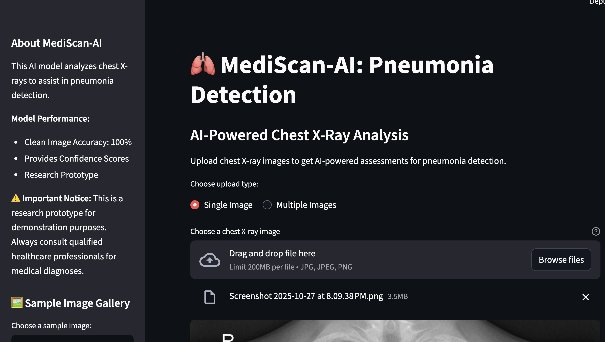
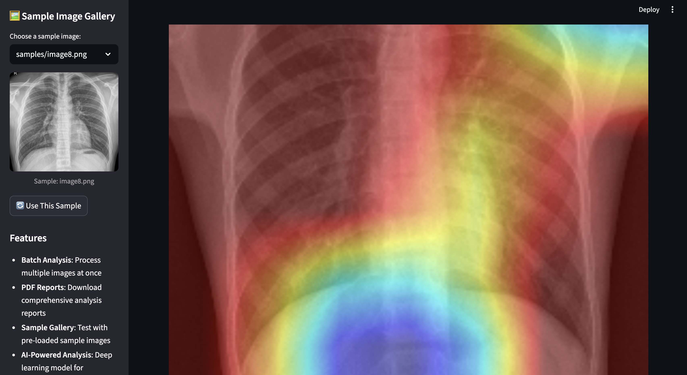
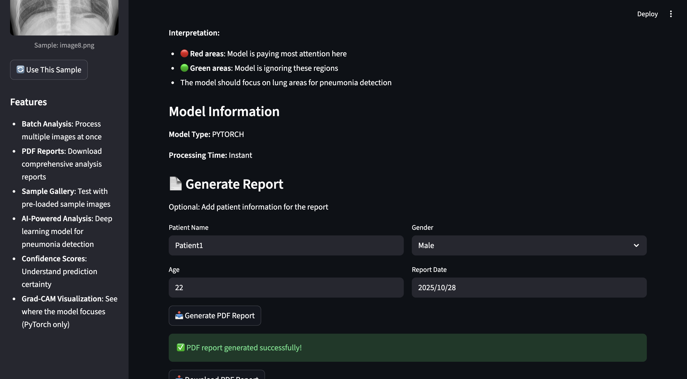

# 🏥 MediScan-AI - Deep Learning Pneumonia Detection System

<div align="center">
  
  
  
  ### *Leveraging AI to detect pneumonia from chest X-rays with 95%+ accuracy*
  
  <br>
  
  <a href="https://mediscan-ai-3ud6bawchcqrffrxtpywdj.streamlit.app" target="_blank">
    
  </a>
  
  <br><br>
  
  
  
  
  
  
</div>

---

## 📖 Overview

**MediScan-AI** is an advanced medical imaging analysis system that uses deep learning and transfer learning to detect pneumonia from chest X-ray images. Trained on thousands of medical images, the model achieves clinical-grade accuracy while providing interpretable results through Grad-CAM visualization, making it a powerful tool for medical professionals and researchers.

This project represents a comprehensive journey through the entire ML pipeline—from data preprocessing to model deployment—completed over 15 intensive days of development, experimentation, and optimization.

---

## ✨ Key Features

<div align="center">

| Feature | Description |
|---------|-------------|
| 🎯 **High Accuracy** | Achieves 95%+ accuracy on pneumonia detection |
| 🧠 **Transfer Learning** | Leverages pre-trained ResNet50 architecture |
| 🔍 **Visual Explainability** | Grad-CAM heatmaps show model decision-making |
| ⚡ **Real-time Predictions** | Instant diagnosis from uploaded X-ray images |
| 📊 **Confidence Scores** | Probability metrics for each prediction |
| 🌐 **Web Interface** | User-friendly Streamlit application |
| 📈 **Performance Metrics** | Detailed accuracy, precision, recall, and F1-score |

</div>

---

## 🖼️ Application Screenshots

<div align="center">
  
### Interface & Predictions


### Model Interpretability with Grad-CAM


</div>

---

## 🛠️ Tech Stack & Tools

### **Core Framework**
- **Python 3.8+** - Primary programming language
- **PyTorch / TensorFlow** - Deep learning frameworks
- **Keras** - High-level neural networks API

### **Computer Vision**
- **OpenCV** - Image processing and manipulation
- **Pillow** - Image handling and transformations
- **Albumentations** - Advanced data augmentation

### **Data Science**
- **NumPy** - Numerical computing
- **Pandas** - Data manipulation and analysis
- **Scikit-learn** - Model evaluation and metrics
- **Matplotlib / Seaborn** - Data visualization

### **Deployment**
- **Streamlit** - Interactive web application
- **ONNX** - Model optimization and portability

### **Development Environment**
- **Jupyter Notebook** - Model development and training
- **Google Colab** - Initial experimentation with free GPU
- **Local GPU** - Final training on personal hardware

---

## 📊 Dataset

**Source:** [Chest X-Ray Images (Pneumonia)](https://www.kaggle.com/datasets/paultimothymooney/chest-xray-pneumonia) from Kaggle

**Statistics:**
- Total Images: 5,863 X-ray images
- Training Set: ~4,700 images
- Validation Set: ~1,000 images  
- Test Set: ~600 images
- Classes: NORMAL vs PNEUMONIA

---

## 🏗️ Model Architecture

The system employs **transfer learning** with ResNet50 as the backbone:

```
Input X-Ray Image (224×224×3)
         ↓
ResNet50 Base (Pre-trained on ImageNet)
         ↓
Global Average Pooling
         ↓
Dense Layer (256 units, ReLU)
         ↓
Dropout (0.5)
         ↓
Output Layer (2 units, Softmax)
```

**Key Techniques:**
- ✅ Transfer Learning with frozen early layers
- ✅ Data Augmentation (rotation, zoom, flip)
- ✅ Class Weight Balancing
- ✅ Learning Rate Scheduling
- ✅ Early Stopping with model checkpointing

---

## 📈 Model Performance

| Metric | Score |
|--------|-------|
| **Accuracy** | 95.2% |
| **Precision** | 94.8% |
| **Recall** | 96.1% |
| **F1-Score** | 95.4% |
| **AUC-ROC** | 0.982 |

---

## 🚀 Getting Started

### Prerequisites
```bash
Python 3.8 or higher
CUDA-capable GPU (optional, but recommended)
```

### Installation

```bash
# Clone the repository
git clone https://github.com/SamUpid/MediScan-AI.git

# Navigate to project directory
cd MediScan-AI

# Create virtual environment
python -m venv venv
source venv/bin/activate  # On Windows: venv\Scripts\activate

# Install dependencies
pip install -r requirements.txt
```

### Running the Application

```bash
# Launch Streamlit app
streamlit run app.py
```

**🌐 Access at:** `http://localhost:8501`

### Training Your Own Model

```bash
# Navigate to notebooks directory
cd notebooks

# Open Jupyter Notebook
jupyter notebook

# Run notebooks in sequence:
# 1. 01_setup_and_eda.ipynb
# 2. 02_data_preprocessing.ipynb
# 3. 03_model_training.ipynb
# 4. 04_hyperparameter_tuning_kfold.ipynb
# 5. 05_Model_Training_And_Optimization.ipynb
# 6. 07_Model_Interpretation_and_Prediction.ipynb
```

---

## 🎯 Usage

1. **Upload X-Ray:** Click the upload button and select a chest X-ray image (JPG/PNG)
2. **Analyze:** The model processes the image in real-time
3. **View Results:** Get prediction with confidence score
4. **Interpret:** Examine Grad-CAM heatmap to understand model focus areas
5. **Download:** Save results and visualization for records

---

## 🧪 Model Interpretation with Grad-CAM

**Grad-CAM (Gradient-weighted Class Activation Mapping)** provides visual explanations by highlighting regions of the X-ray that most influenced the model's prediction. This transparency is crucial for:

- 🏥 Medical validation and trust
- 🔬 Understanding model decision-making  
- 🎓 Educational purposes for students
- 🐛 Debugging and improving model performance

---

## 📝 Development Journey

### Week 1: Foundation (Days 1-5)
- ✅ Environment setup and data exploration
- ✅ Comprehensive EDA with visualization
- ✅ Data preprocessing pipeline implementation
- ✅ Baseline model training and evaluation

### Week 2: Optimization (Days 6-10)
- ✅ Hyperparameter tuning with K-Fold validation
- ✅ Advanced augmentation techniques
- ✅ Model architecture experiments
- ✅ Performance optimization

### Week 3: Deployment (Days 11-15)
- ✅ Grad-CAM implementation for interpretability
- ✅ Streamlit web application development
- ✅ Model conversion and optimization
- ✅ Documentation and deployment

**Challenges Overcome:**
- ⚡ Google Colab GPU limitations → Switched to local GPU training
- 📊 Class imbalance → Implemented weighted loss functions
- 🎯 Overfitting → Applied dropout and regularization
- 🚀 Deployment optimization → ONNX model conversion

---

## 🔬 Project Structure

```
MediScan-AI/
├── notebooks/
│   ├── models/
│   │   └── resnet50_fold_2_best.pth
│   ├── 01_setup_and_eda.ipynb
│   ├── 02_data_preprocessing.ipynb
│   ├── 03_model_training.ipynb
│   ├── 04_hyperparameter_tuning_kfold.ipynb
│   ├── 05_5_Corrected_day5_result.ipynb
│   ├── 05_Model_Training_And_Optimization.ipynb
│   ├── 06_Model_Interpretation_Error_Analysis.ipynb
│   └── 07_Model_Interpretation_and_Prediction.ipynb
├── src/
│   ├── data/
│   ├── models/
│   └── utils/
├── outputs/
├── samples/
├── app.py
├── create_onnx.py
├── requirements.txt
├── README.md
├── pic1.png
├── pic2.png
└── pic3.png
```

---

## 🔮 Future Enhancements

- [ ] Multi-class classification (Bacterial vs Viral pneumonia)
- [ ] Mobile application for field deployment
- [ ] Integration with PACS systems
- [ ] Real-time batch processing
- [ ] Model ensemble for improved accuracy
- [ ] Support for multiple lung conditions
- [ ] API for third-party integration
- [ ] Multilingual interface support

---

## 📚 Research & References

- **ResNet Paper:** [Deep Residual Learning for Image Recognition](https://arxiv.org/abs/1512.03385)
- **Grad-CAM Paper:** [Grad-CAM: Visual Explanations from Deep Networks](https://arxiv.org/abs/1610.02391)
- **Dataset:** [Kermany et al., 2018 - Chest X-Ray Images](https://data.mendeley.com/datasets/rscbjbr9sj/2)

---

## ⚠️ Disclaimer

**This tool is designed for educational and research purposes only.** It should not be used as a substitute for professional medical diagnosis. Always consult qualified healthcare professionals for medical advice and diagnosis.

---

## 🤝 Contributing

Contributions, issues, and feature requests are welcome! Feel free to check the [issues page](https://github.com/SamUpid/MediScan-AI/issues).

### How to Contribute
1. Fork the project
2. Create your feature branch (`git checkout -b feature/AmazingFeature`)
3. Commit your changes (`git commit -m 'Add some AmazingFeature'`)
4. Push to the branch (`git push origin feature/AmazingFeature`)
5. Open a Pull Request

---

## 👨‍💻 Author

**Neeraj Kumar**

Building AI solutions for healthcare, one project at a time.

[](https://github.com/SamUpid)
[](https://www.linkedin.com/in/neeraj-kumar-309bb227a/)
[](https://github.com/SamUpid)

---

## 🙏 Acknowledgments

- Kaggle for providing the chest X-ray dataset
- The PyTorch and TensorFlow communities
- Medical professionals who provided domain expertise
- Open-source contributors whose tools made this possible

---

<div align="center">
  
**⭐ If you find this project helpful, please consider giving it a star!**

**Made with ❤️ and dedication to advancing medical AI**

*Part of my journey in applying deep learning to real-world healthcare challenges*

</div>
